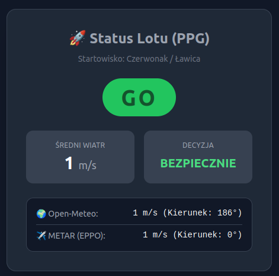

# 🪂 Pogoda PPG - Weather API

[](https://github.com/tzietkowski/pogoda_ppg/actions)


A backend API service built with **Laravel**, designed to evaluate and analyze weather conditions for paramotoring (PPG) flights in the Czerwonak/Poznań area. 

## 📸 Podgląd aplikacji


The application aggregates meteorological data from various external providers, processes it through a custom evaluation engine, and exposes clear, flight-readiness metrics via RESTful endpoints. It also maintains a historical log of weather conditions in a database for future trend analysis.

## 🎯 Key Features & Architecture
This project is built with a strong focus on clean code and modern PHP architecture:
* **External API Integrations:** Fetches real-time data from Open-Meteo and aviation METAR stations (EPPO).
* **Object-Oriented Design (OOP):** Heavily utilizes Interfaces, Abstract Classes, and polimorphism to ensure a modular data-fetching layer.
* **Database Logging (Eloquent ORM):** Automatically logs weather reports and raw API responses (stored as JSON) into MySQL using Laravel Migrations and Eloquent.
* **Automated Testing:** Fully tested using Feature and Unit tests, including simulated/mocked HTTP requests to external APIs to guarantee reliability without hitting live servers.
* **Dependency Injection:** External providers and internal services are decoupled and injected, adhering to **SOLID** principles.

## 🛠️ Tech Stack
* **Language:** PHP 8.x (Strict Types)
* **Framework:** Laravel 11.x
* **Database:** MySQL
* **Testing:** PHPUnit / Pest (Http::fake)
* **Environment:** Docker (Laravel Sail)

## 🚀 Local Setup (Docker)
This project uses Laravel Sail for a seamless, containerized development environment.

1. Clone the repository:
   ```bash
   git clone git@github.com:tzietkowski/pogoda_ppg.git
   cd pogoda_ppg

2. Install dependencies:
   ```bash
   composer install

3. Copy the environment file and generate the app key:
   ```bash
   cp .env.example .env
   ./vendor/bin/sail artisan key:generate

4. Start the Docker containers:
   ```bash
   ./vendor/bin/sail up -d

## 📡 API Endpoints
GET /api/conditions
Analyzes current weather data from multiple providers and returns a flight-readiness report. Every successful request is automatically logged to the database.

Response (200 OK):
```json
{
  "status": "GO",
  "average_wind_ms": 2.5,
  "is_safe_to_fly": true,
  "warning": null,
  "details": {
    "open_meteo": {
      "wind_speed_ms": 2.3,
      "direction_deg": 180
    },
    "metar_eppo": {
      "wind_speed_ms": 2.7,
      "direction_deg": 170
    }
  }
}
```
Error Response (503 Service Unavailable):
Triggered if external weather APIs fail to respond or return invalid data.

```json
{
  "error": "Nie udało się pobrać danych pogodowych.",
  "message": "Awaria sieci: Nie udało się pobrać danych z Open-Meteo"
}
```